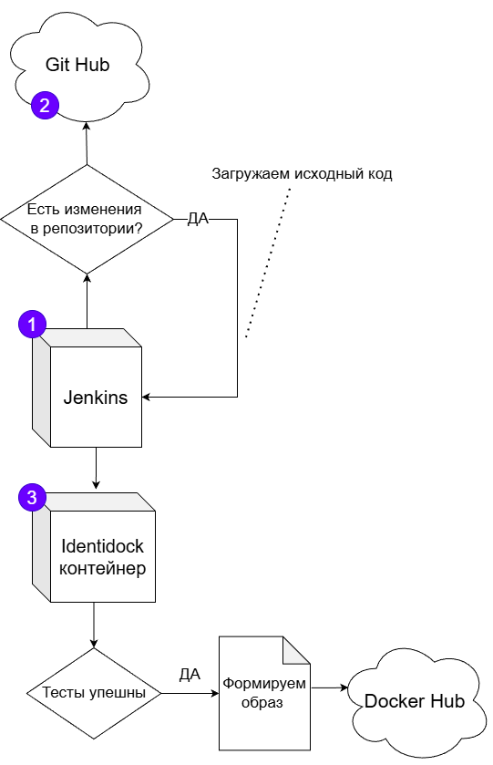

# Identidock

Приложение генерирует уникальное изображение (монстрика) на основе введённой пользователем строки.

---
## Как запускать
Для полноценной работы `identidock` требуются также сервисы `dnmonster` и `Redis`. Самый простой способ — создать файл **`docker-compose.yml`**

### Параметры для PROD:
```yml
services:
  identidock:
    image: tumanyan/identidock:newest
    ports:
      - "9090:9090"
    environment:
      ENV: PROD
    depends_on:
      - dnmonster
      - redis

  dnmonster:
    image: amouat/dnmonster:1.0

  redis:
    image: redis:8.6.2-alpine
```
Далее выполнить команду: `docker-compose up -d`

Или вместо этого вы можете выполнить команды отдельно (рекомендую использовать первый способ):

```bash
docker run -d --name dnmonster amouat/dnmonster:1.0
docker run -d --name redis redis:8.6.2-alpine
docker run -d --name identidock -p 9090:9090 --link dnmonster --link redis -e ENV=PROD tumanyan/identidock:newest
```

Проверить работу можно через браузер или командой: `curl http://localhost:9090`

### DevOps: путь самурая через Connection refused
Я использовал этот репозиторий для изучения DevOps-практик. Так как без Docker невозможно представить работу DevOps, начнем именно с него. Ниже приведено описание проделанной работы, основанное на материале книги "Использование докер". 

1. Шаг - ***Сборка и запуск python приложения*** (identidock.py) в Docker-контейнере.
    Приложение написано на *Flask*. В качестве сервера используется *uWSGI*.
2. Шаг - ***Хотелось бы использовать один образ для разработки и отладки***, а также изменять набор параметров. Решение - добавление скрипта cmd.sh:

```bash
#!/bin/bash
set -e

if [ "$ENV" = 'DEV' ]; then
   echo "Running Development Server" # Запуск сервера для разработки
   exec python "identidock.py"
elif [ "$ENV" = 'UNIT' ]; then
   echo "Running Unit Tests"
   exec python "tests.py"
else
   echo "Running Production Server" # Запуск сервера для эксплуатации
   exec uwsgi --ini /app/uwsgi.ini
fi

```

В зависимости от переменной ENV запускает веб-сервер в соответсвующем режиме: разработки/отладки (DEV), тестирования (UNIT), эксплуатации (PROD). 

Для упрощения конфигурирования среды и связи контейнеров создан **docker-compose.yml**

3. Шаг - Входные данные обладают свойством идемпотентности (для одинакового текста генерируется одинаковая картинка), логично встает вопрос ***кэширования данных***. **Redis** является можно сказать стандартом => разворачиваем новый контейнер, обновляем связи между контейнерами в docker-compose.

4. Шаг - ***Распространение образов***. В книге описывается организация собственного реестра, но этот шаг я решил пропустить, потому что: 
    - Есть *Docker Hub* и еще несколько бесплатных сервисов, которые позволяют зайти с любого устройства, авторизоваться и сделать pull своих образов. Собственный же реестр предполагает квест по созданию и распространению TLS сертификата.
    - В Docker Hub имеется графический интерфейс для взаимодействия с любыми образами.
    - Отсутствует необходимость в приватных образах.
    - На самый крайний случай есть docker export/import.

5. Шаг - ***Создаем CI/CD pipeline***. Добавляем несколько unit тестов приложения для проверки функциональных возможностей и создаем контейнер ***Jenkins***. Автор предлагает организовать работу так, чтобы Jenkins сам мог собирать образы. Однако подход «иметь готовую среду, в которой выполняются дальнейшие операции» кажется более надёжным. Технологию Docker-in-Docker отвергаем, т.к. запускать контейнер в привилегированном режиме == удалить свою основную систему, скомпрометировать все данные, вызвать мировой кризис... выбираем *Socket Mounting*.<br><br>Полную процедуру не описываю, но важно, что мы создаем *контейнер данных* для постоянного хранения конфигурации:

```bash
docker build -t identijenk .
docker run --name jenkins-data identijenk echo "Jenkins Data Container"
``` 
Этот контейнер данных нужен только для того, чтобы использовать--volumes-fromпри запуске Jenkins.

```bash
docker run -d --name jenkins -p 8080:8080 --volumes-from jenkins-data \
    -v /var/run/docker.sock:/var/run/docker.sock identijenk
```

Дальнейшая настройка идет уже в графическом интерфейсе `http://localhost:8080`

Настраиваем цепочку взаимодействия, которая выглядит примерно так:



***Резервное копирование*** 

```bash
# Создание бэкапа
docker run --volumes-from jenkins-data -v $(pwd):/backup \
    debian tar -zcvf /backup/jenkins-data-backup.tar.gz /var/jenkins_home

# Восстановление (пример)
docker run --name jenkins-data2 identijenk echo "New Jenkins Data Container"
docker run --volumes-from jenkins-data2 -v $(pwd):/backup \
    debian tar -xzvf /backup/jenkins-data-backup.tar.gz -C /
```

Самой большой болью этого этапа оказалась настройка сетевого взаимодействия между создаваемыми контейнерами, но после ~40 неудачных сборок pipeline был настроен.

---
## __Структура файлов__ 
_identidock_ - Каталог приложения identidock 
_identijenk_ - Каталог для Jenkins

---
## __Ссылки__
"Using Docker" by Adrian Mouat - https://files.znu.edu.ua/files/Bibliobooks/Inshi70/0051001.pdf
