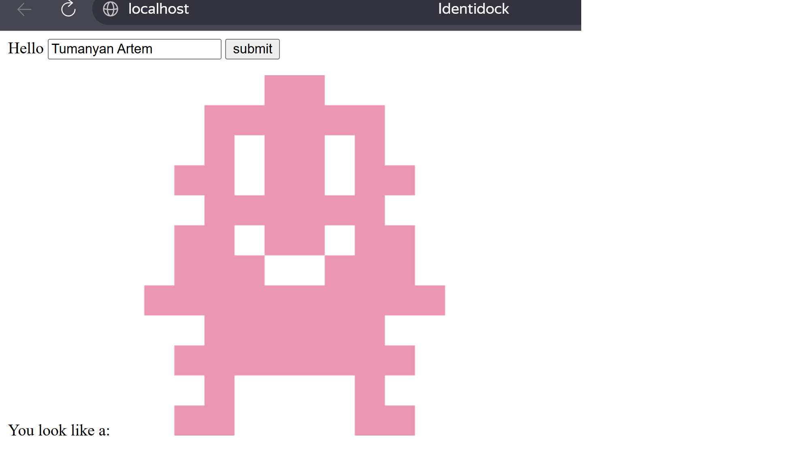
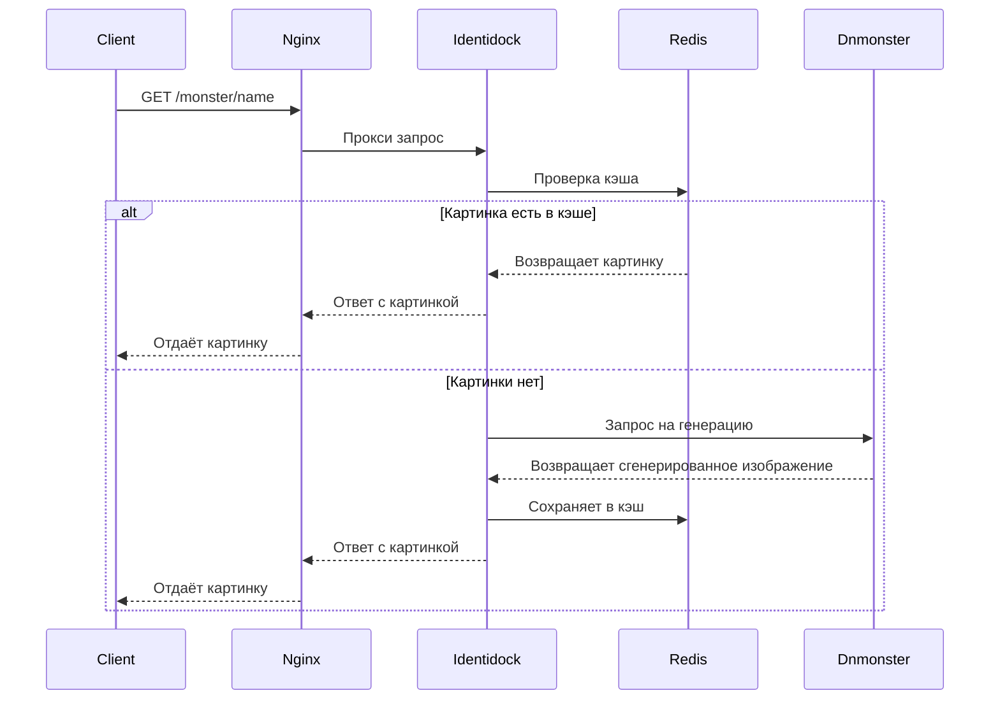
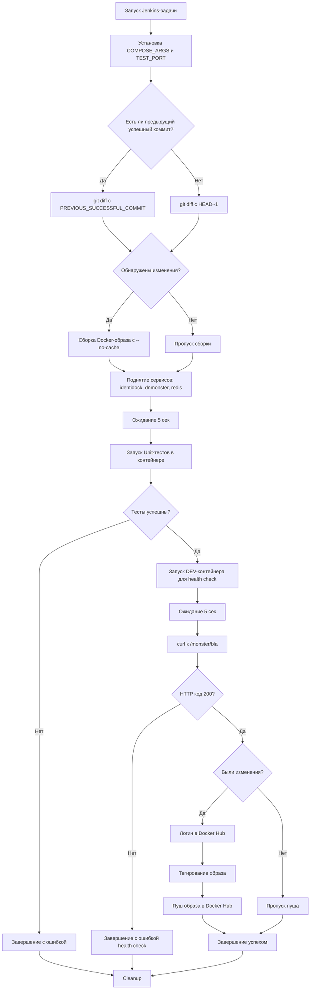
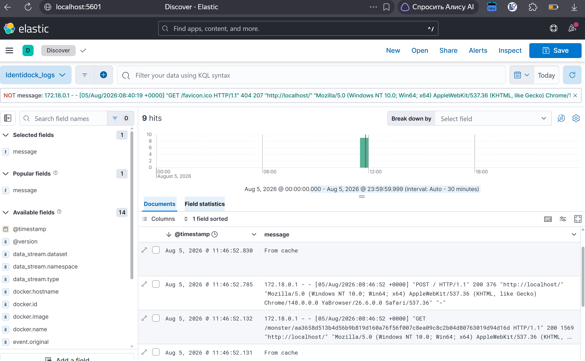
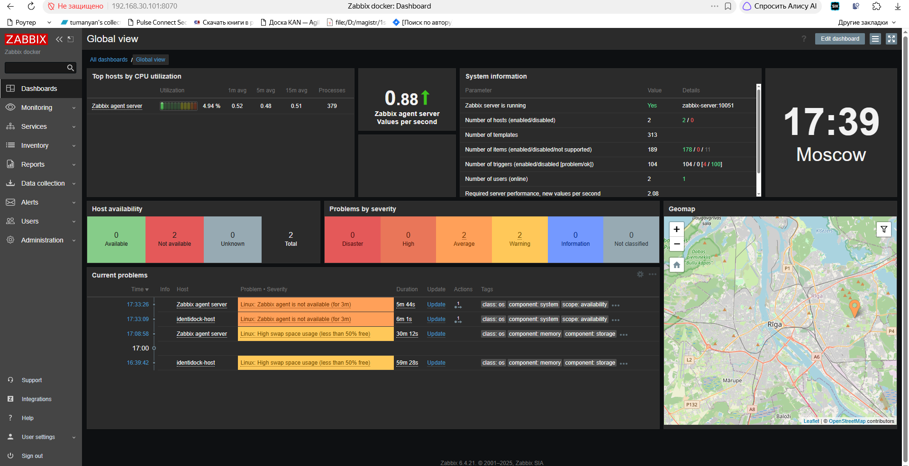
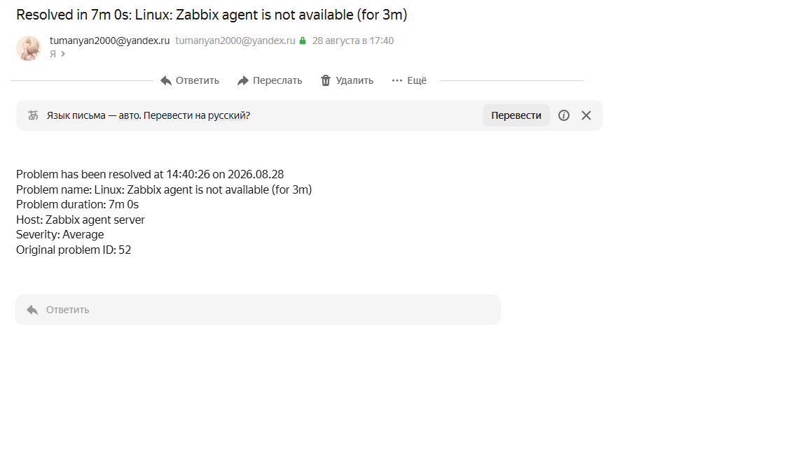
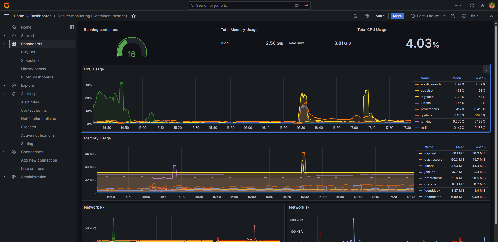
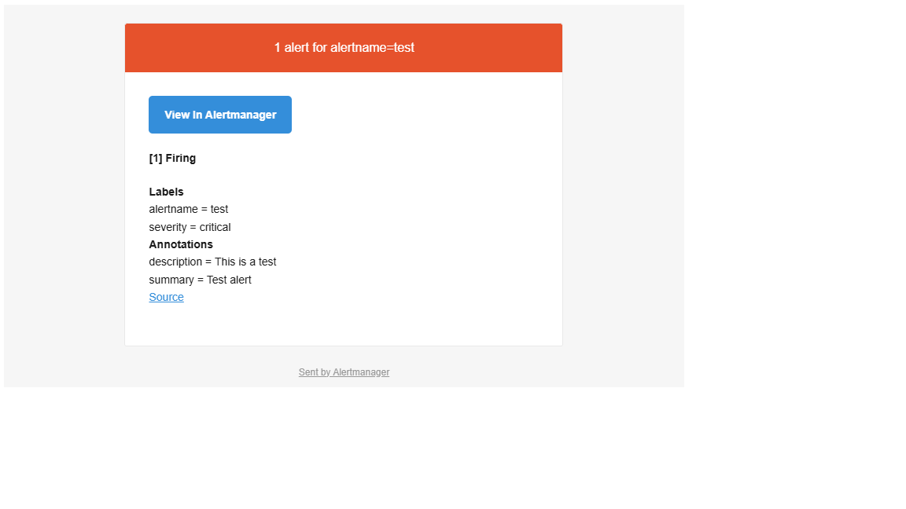

# Identidock

Приложение генерирует уникальное изображение (монстрика)<br>
на основе введённой пользователем строки.<br>
<br><br>

---
## Как запускать
1. Выполнить `git clone`.<br>
2. Перейти в каталог identiproxy и выполнить сборку `docker build -t proxy:1.0 .` .<br>
3. Поправить  **`docker-compose.yml`** файл,<br>
указав актуальный IP адрес для переменной `NGINX_HOST`<br>
4. Выполнить команду: `docker-compose up -d`<br>

**Для настройки CI\CD** (Jenkins)<br>
5. Перейти в каталог identijenk и выполнить сборку `docker-compose up -d`.<br>
Далее потребуется настроить задачу в интерфейсе. Пример для shell скрипта расположен в каталоге identijenk.<br>

**Для настройки мониторинга приложения** (ELK + logspout)<br>
6. Перейти в каталоги monitoring и выполнить сборку `docker-compose up -d`.<br>
Далее потребуется выбрать индекс в интерфейсе Elasticsearch

**Для настройки мониторинга инфраструктуры** (Zabbix Server + PostgreSQL + Web)<br>
7. Перейти в каталог monitoring/zabbix переименовать файл `.env_template` в `.env` и задать переменные.<br> 
Выполнить сборку `docker-compose up -d`.<br>
Установить zabbix агент на целевой хост:
```bash
wget https://repo.zabbix.com/zabbix/6.4/ubuntu/pool/main/z/zabbix-release/zabbix-release_6.4-1+ubuntu22.04_all.deb
sudo dpkg -i zabbix-release_6.4-1+ubuntu22.04_all.deb
sudo apt update
sudo apt install zabbix-agent -y
```
Далее в web-интерфейсе Zabbix http://localhost:8070 (логин: Admin, пароль: zabbix - по умолчанию, далее можно изменить) <br>
добавить хост с установленным агентом в Data Collection -> Hosts (т.к. zabbix устанавливается в docker, адрес хоста необходим в сети docker).<br>
Пример команды на хосте: `docker network inspect zabbix-net | grep Gateway`<br>
В интерефейсе можно также настроить Alerts -> Actions -> Trigger actions и Actions -> Media types для уведомлений<br>

**Для настройки сбора метрик и визуализации** (cAdvisor + Prometheus + Alertmanager + Node Exporter + Grafana).<br>
8. Перейти в каталог metrics переименовать файл `.env_template` в `.env` и задать переменные. <br> Выполнить сборку `docker-compose up -d` .<br><br>
Далее потребуется выбрать источники данных/настроить dashboards в интерфейсе Grafana.<br>
Для Node Exporter можно выбрать 1860.<br>
Для cAdvisor можно выбрать 14282.<br>


### Проверка работоспособности

- Приложение: http://localhost:80
- Kibana: http://localhost:5601
- Jenkins: http://localhost:8090
- Elasticsearch: http://localhost:9200
- cAdvisor: http://localhost:8085
- Prometheus: http://localhost:9090
- Grafana: http://localhost:3000
- Zabbix: http://localhost:8070
- Alertmanager: http://192.168.30.53:9093 <br>
Если alertов нет, для проверкb можно сгенерировать тестовый через api: <br>
`curl -X POST -H "Content-Type: application/json" -d '[{"labels":{"alertname":"test","severity":"critical"},"annotations":{"summary":"Test alert","description":"This is a test"}}]' http://localhost:9093/api/v2/alerts`

---
### Технологии и инструменты
Работа основана на материале книги "Использование Docker".<br>

| Категория | Технологии |
|-----------|-----------|
| Языки | Python, Bash |
| Веб-фреймворк | Flask |
| Контейнеризация | Docker, Docker Compose |
| CI/CD | Jenkins, GitHub |
| Мониторинг | ELK Stack (Elasticsearch, Logstash, Kibana), Logspout,  Zabbix |
| Сбор метрик | cAdvisor, Prometheus, Grafana, Alertmanager, Node Exporter |
| Оркестрация | Ansible |
| Базы данных | Redis, PostgreSQL |
| Веб-сервер | Nginx, uWSGI |

<br><br>
***Схема работы приложения***


```mermaid
sequenceDiagram
    participant Client
    participant Nginx
    participant Identidock
    participant Redis
    participant Dnmonster

    Client->>Nginx: GET /monster/name
    Nginx->>Identidock: Прокси запрос
    Identidock->>Redis: Проверка кэша
    alt Картинка есть в кэше
        Redis-->>Identidock: Возвращает картинку
        Identidock-->>Nginx: Ответ с картинкой
        Nginx-->>Client: Отдаёт картинку
    else Картинки нет
        Identidock->>Dnmonster: Запрос на генерацию
        Dnmonster-->>Identidock: Возвращает сгенерированное изображение
        Identidock->>Redis: Сохраняет в кэш
        Identidock-->>Nginx: Ответ с картинкой
        Nginx-->>Client: Отдаёт картинку
    end
```
<br>

***Сборка и запуск python приложения*** (identidock.py) в Docker-контейнере.<br>
Приложение написано на *Flask*. В качестве сервера используется *uWSGI*.<br><br>

***DEV/UNIT/PROD*** скрипт cmd.sh определяет в каком окружении будет <br>
запускаться приложение.<br><br>

***CI/CD pipeline*** использован *Jenkins*.<br>
Использован подход Continuous Deployment. Задача проверяет репозиторий GitHub.<br>
Если в коде приложения/docker файлах есть изменения -> поднимаются контейнеры<br>
в тестовом окружении и запускаются тесты.<br>
Если тесты прошли образы заливаются в репозиторий DockerHub.<br>
При запуске приложения берутся образы из DockerHub и происходит сборка<br>
в PROD окружении.<br><br>


```mermaid
flowchart TD
    A[Запуск Jenkins-задачи] --> B[Установка COMPOSE_ARGS и TEST_PORT]
    B --> C{Есть ли предыдущий успешный коммит?}
    C -- Да --> D[git diff с PREVIOUS_SUCCESSFUL_COMMIT]
    C -- Нет --> E[git diff с HEAD~1]
    D --> F{Обнаружены изменения?}
    E --> F
    F -- Нет --> G[Пропуск сборки]
    F -- Да --> H[Сборка Docker-образа с --no-cache]
    H --> I[Поднятие сервисов: identidock, dnmonster, redis]
    G --> I
    I --> J[Ожидание 5 сек]
    J --> K[Запуск Unit-тестов в контейнере]
    K --> L{Тесты успешны?}
    L -- Нет --> M[Завершение с ошибкой]
    L -- Да --> N[Запуск DEV-контейнера для health check]
    N --> O[Ожидание 5 сек]
    O --> P[curl к /monster/bla]
    P --> Q{HTTP код 200?}
    Q -- Нет --> R[Завершение с ошибкой health check]
    Q -- Да --> S{Были изменения?}
    S -- Нет --> T[Пропуск пуша]
    S -- Да --> U[Логин в Docker Hub]
    U --> V[Тегирование образа]
    V --> W[Пуш образа в Docker Hub]
    W --> X[Завершение успехом]
    T --> X
    M --> Z[Cleanup]
    R --> Z
    X --> Z
```

***Мониторинг приложения*** использован стек *ELK*.<br>
*Logspout* - собирает логи всех приложений на хосте.<br>
*Logstash* - фильтрует логи.<br>
*Elasticsearch* - хранит логи, создает индексы для быстрого поиска.<br>
*Kibana* - отображает логи для анализа.<br>

<br><br>

***Мониторинг инфраструктуры*** использован *Zabbix*. <br>
*Zabbix Agent* - установлен на хосте/ах, отправляет метрики. <br>
*Zabbix Web* - отображает собранные метрики. <br>

<br><br>
<br>

***Сбор метрик*** использована связка Prometheus + Grafana + Alertmanager.<br>
*cAdvisor* - собирает метрики всех контейнеров на хосте (CPU, память, сеть, диски)<br>
*Prometheus* - хранение и анализ временных рядов метрик, язык запросов PromQL<br>
*Grafana* - визулизация метрик, построение дашбордов<br>
*Alertmanager* - обработка и отправка алертов

<br><br>
<br>

***Настройка на нескольких хостах*** использован *Ansible*.<br>
Необходимо установить ansible на целевую машину - хост.<br>
Прокинуть ssh ключи на целевые машины (target, где должно рабоать приложение),<br>
скорректировать файл hosts (inventory) и актуализировав `NGINX_HOST`<br>
в `identidock.yml`.<br>
Далее можно будет вызвать:

```bash
ansible-playbook -i hosts identidock.yml
```
<br>Приложение будет развернуто на target хостах.

***Ротирование логов*** использован logrotate Linux.<br>
Если не настроено ротирование логов для Docker,<br>
то очень быстро закончится место на диске.<br>
В ОС Linux рекомендуется выполнить скрипт<br>
docker_logrotate.sh c root правами.

---
### Структура файлов
- **identidock/** - исходный код Flask-приложения
- **identijenk/** - конфигурация Jenkins
- **identiproxy/** - конфигурация Nginx (балансировщик)
- **monitoring/** - конфигируция ELK (настройка парсинга логов, данные ELK, Logspout)
- **monitoring/zabbix** - конфигурация Zabbix
- **metrics/** - конфигурация метрик (cAdvisor, Prometheus, Grafana, Alertmanager)
- **usefull_scripts/** - опциональные скрипты для разового запуска
- **ansible_configuration/** - Ansible плейбуки для деплоя
- **screenshots/** - скриншоты для README
- **common.yml** - версии образов для сервисов приложения

---
### Известные проблемы и их решение

**Windows ошибка**: "exec /cmd.sh: no such file or directory".<br>
**Причина:** CRLF окончания строк в скриптах.<br>
**Решение:** Конвертируйте скрипты в формат LF<br>

```powershell
(Get-Content cmd.sh) -join "`n" | Set-Content -NoNewline cmd.sh
```

***Ошибка доступа к Docker Hub***
**Причина:** Не настроены credentials для Jenkins.<br>
**Решение:** Укажите свои логин/пароль и репозиторий в Jenkins-задаче.<br>
<br>

---
## Ссылки
"Using Docker" by Adrian Mouat - https://files.znu.edu.ua/files/Bibliobooks/Inshi70/0051001.pdf
